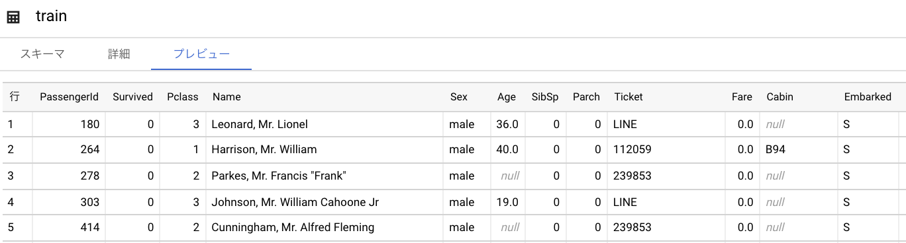
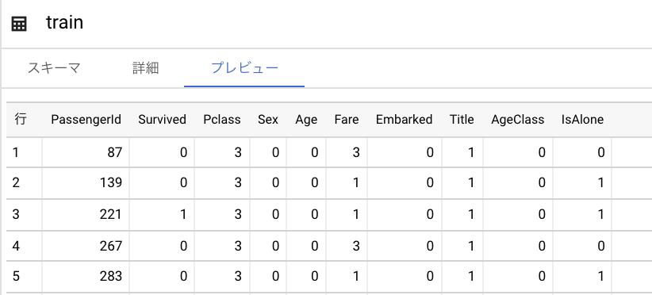
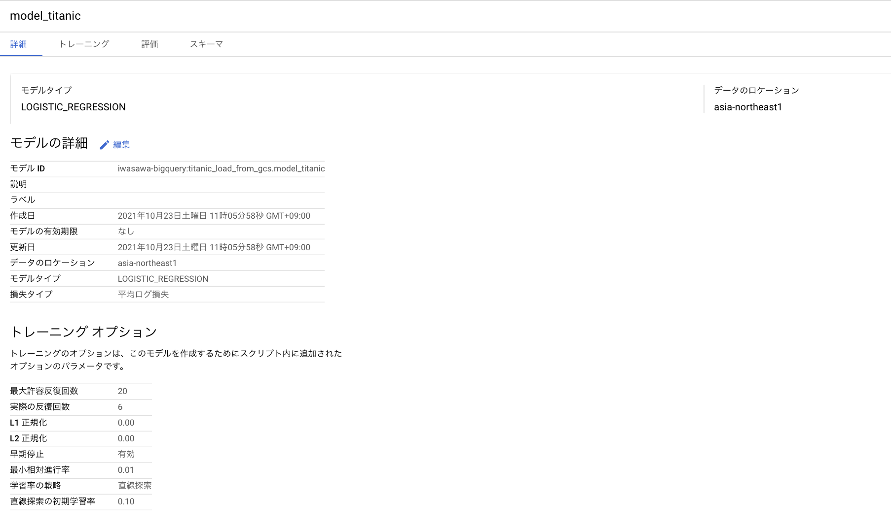
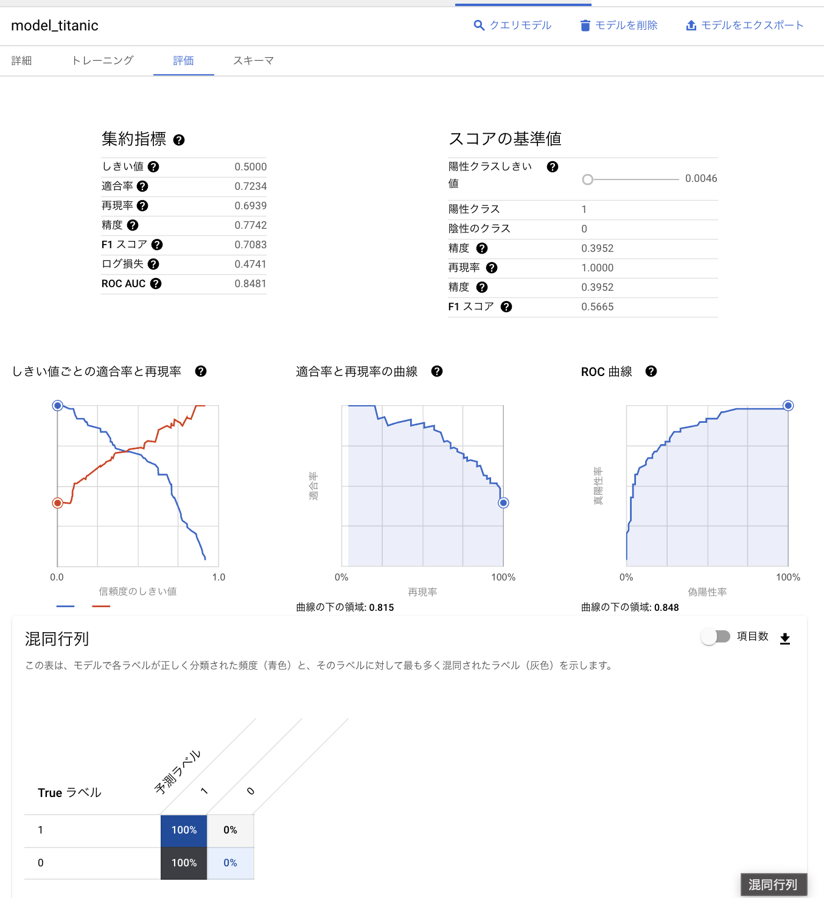

# 概要
BigQueryで以下のETL処理を行い、BigQuery MLでモデル作成をしました。
機械学習の社会実装勉強会 第4回の発表内容です。
https://www.slideshare.net/ssusere6d3be/bigquery-ml-datapipeline

1. GoogleCloudStorageへCSVファイルを(train.csv, test.csv)アップロード
1. Cloud Functionsが前処理を実行
1. BigQueryへロード
1. ML model 作成・評価・予測

Todo: StepByStep へ手順画像を追記する
# Training data
Source (Titanic)
https://www.kaggle.com/c/titanic/overview

# Cloud function
トリガーをGCSへのファイルのアップロードイベントに指定。

- Scripts
  - Load to BigQuery: [load_data_from_gcs.py](./load_data_from_gcs.py)
  - Preprocessing: [preprocess.py](./preprocess.py)
  - Module: [requirements.txt](./requirements.txt)

# BigQuery ML

- [SQL](./bigquery/)
  
  
