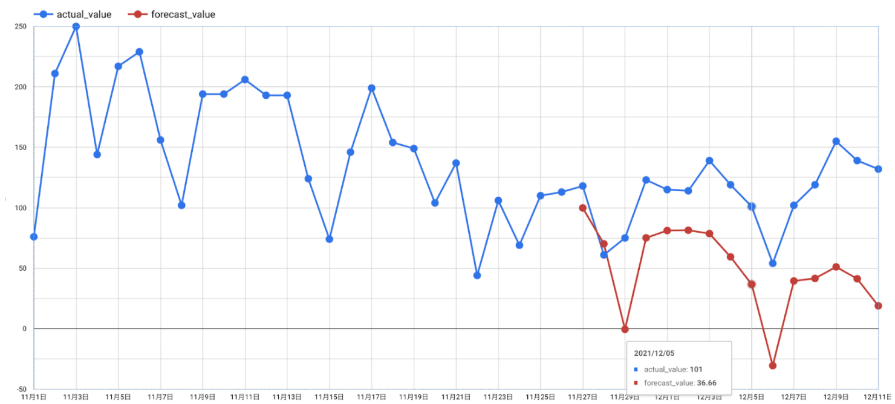
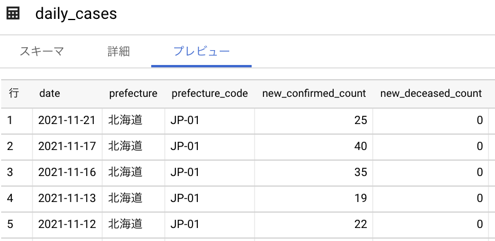

# 概要
BigQueryでARIMAモデルを用いてCOVID-19の予測モデルを作成しました。

- Result SQL: [arima_result.sql](./arima_result.sql)

- Train data
  - File name: [create_table_covid_19_in_japan.sql](./create_table_covid_19_in_japan.sql)

- Training SQL (Create model)
  - File name: [arima_model_create.sql](./arima_model_create.sql)
  

- Prediction SQL
  - File name: [arima_model_predict.sql](./arima_model_predict.sql)
  
