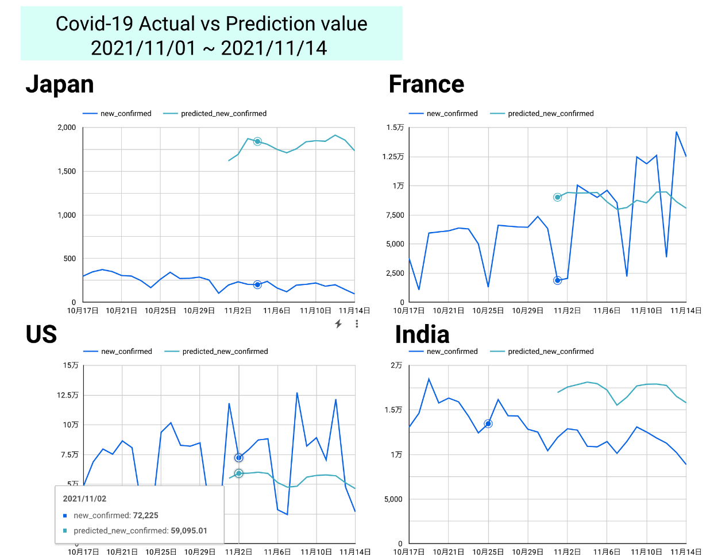
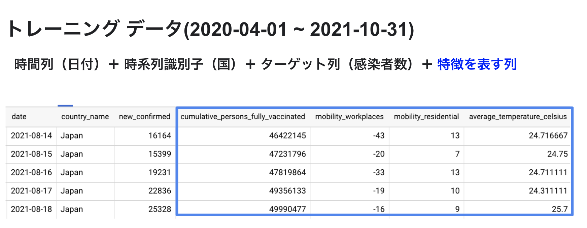
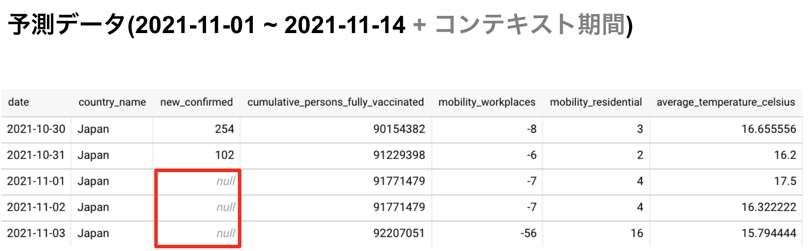

# 概要
Vertex AIを用いて、COVID-19の予測モデルを作成しました。

[CSV for dashboad](./csv/2021-09-01_2021-11-14_actual_plus_predicted_result.csv)

- Train data
  - File name: [covid19_train_gen.sql](./20211218_vertex_ai/covid19_train_gen.sql)
  - Period: 2021-04-01 ~ 2021-10-31
  - Output: [train_data](./csv/2020-04-01_2021-10-31_for_train_data.csv) 

- Predict data
  - File name: [covid19_predict_gen.sql](./covid19_predict_gen.sql)
  - Period: 2021-04-01 ~ 2021-11-14 (Need to update the value of `new_confirmed` to NULL in the last 14 days)
  - Output: [predict_data](./csv/2021-04-01_2021-11-14_for_prediction_data.csv)

*予測ウィンドウを14日にした場合、Predict data の最後の14日間を `NULL` にする必要があります。
